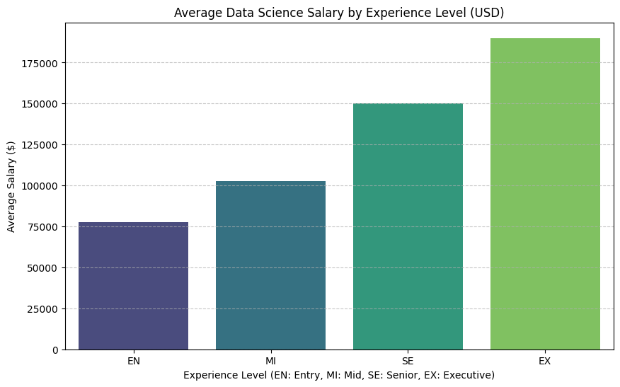

##Data Science Salaries Global Analysis
#Project Overview
This project provides an exploratory data analysis (EDA) of global salary trends within the Data Science industry. It aims to uncover how experience levels and job titles influence compensation across different regions.

#Technical Stack
Language: Python

Data Manipulation: Pandas

Data Visualization: Matplotlib & Seaborn

#Key Features
Experience Correlation: Analyzes the salary gap between Entry (EN), Mid (MI), Senior (SE), and Executive (EX) levels.

Job Title Insights: Identifies the highest-paying roles in the current tech market.

Automated Visualization: Generates clear, professional charts to represent complex statistical data.

#Core Concepts Demonstrated
Data Grouping: Efficiently aggregating data to find averages and trends.

Statistical Analysis: Interpreting raw data to extract meaningful business insights.

Data Cleaning: Filtering and preparing datasets for accurate processing.

